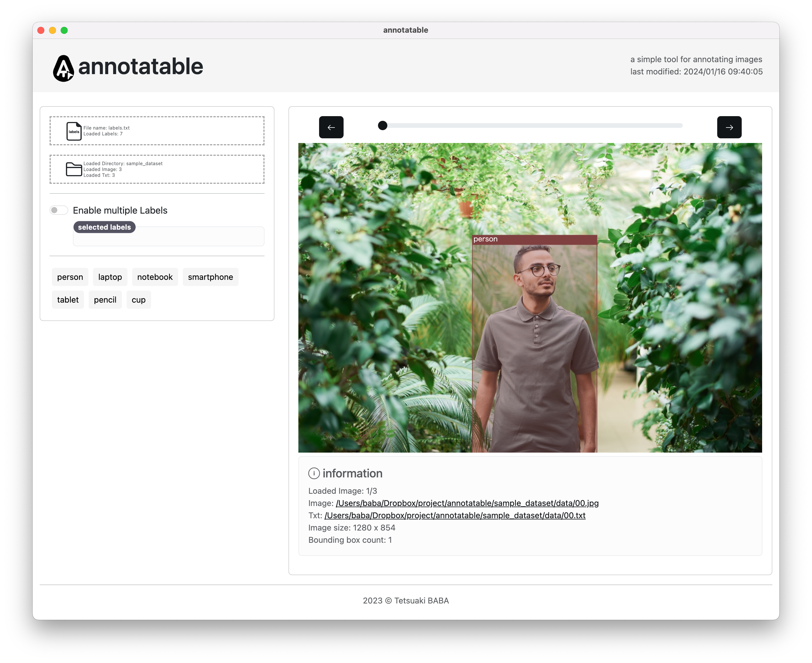

# annotatable
annotatable is a simple image annotation tool for object detection.


## Getting started
```
git clone https://github.com/TetsuakiBaba/annotatable.git
cd annotatable
npm install
npm start
```
Drag and drop a folder containing images and annotations to the app.

## Change labels
You can change labels in `src/labels.js`.

## Supported annotation format
 * YOLO Objecct Dectection: [label id] [x] [y] [width] [height]